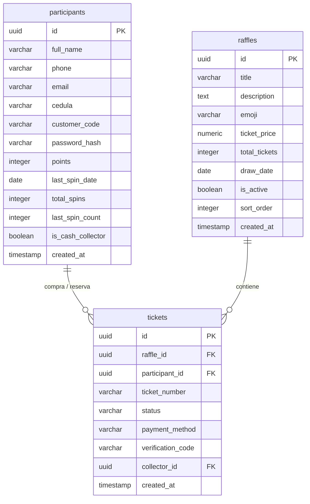

# 🦈 Shark Rifas - Sistema Premium de Gestión de Sorteos Online

¡Bienvenido a **Shark Rifas**! Una plataforma web moderna, interactiva y robusta diseñada para la gestión, venta y verificación de boletos de rifas online en la República Dominicana. Este sistema combina una interfaz dinámica de última generación con una arquitectura segura y optimizada.

---

## 💡 El Problema que Resuelve

Organizar sorteos y rifas de manera tradicional o informal a través de redes sociales suele presentar diversos retos:
1. **Falta de Confianza y Transparencia:** Los participantes temen fraudes, números duplicados o manipulaciones en la elección de ganadores.
2. **Fricción en el Pago y Validación:** Validar transferencias bancarias de múltiples bancos manualmente es un proceso lento y propenso a errores.
3. **Complejidad de Gestión:** Llevar el control de números ocupados y reservados en hojas de cálculo tradicionales o libretas genera colisiones y sobreventa de boletos.
4. **Bajo Involucramiento del Cliente:** Los usuarios compran una vez y no regresan a la plataforma por falta de incentivos.
5. **Brecha Digital en Ventas Físicas:** Muchos clientes prefieren pagar en efectivo en persona, dejando fuera del sistema automatizado esas transacciones.

### 🎯 Nuestra Solución
**Shark Rifas** centraliza todo el ciclo en una sola plataforma:
* **Transparencia Total:** Los sorteos se basan en loterías externas oficiales (como **Pick 4 Florida**), asegurando la total aleatoriedad del número ganador de 4 dígitos.
* **Proceso de Compra Automatizado y Seguro:** Control simultáneo de transacciones concurrentes en base de datos para evitar la colisión de números.
* **Sistema Antibloqueo/Antifraude:** Toda reserva genera un código secreto único y está sujeta a verificación manual mediante capturas de pago. Cuenta con una política de cancelación automática si el pago no se confirma en 24 horas.
* **Gamificación y Fidelización:** Los usuarios pueden ganar puntos participando en una **ruleta diaria** y canjearlos por boletos reales, además de competir por el bono al **Mayor Comprador**.
* **Soporte para Cobradores en Efectivo:** Los agentes autorizados pueden vender boletos en la calle y registrarlos directamente en efectivo, marcándolos como "pagados" al instante sin requerir comprobantes digitales.

---

## 🚀 Características Principales

### 📱 Para los Usuarios
* **Catálogo de Rifas Activas:** Visualización de premios (como motocicletas Yamaha YZ / Kawasaki KX, pasolas Super Gato Bengala o efectivo), precios en pesos dominicanos (RD$), porcentaje de avance y temporizadores de cuenta regresiva.
* **Pasarela de Reserva Flexible:** Permite seleccionar la cantidad de boletos y realizar el pago mediante:
  * **PayPal**
  * **Transferencias Bancarias Locales** (Banreservas, Qik, Banco BHD) con instrucciones detalladas de concepto de pago.
  * **Puntos de Recompensa** acumulados.
* **Verificación Instantánea de Premios:** Si un boleto asignado coincide con los *Números Ganadores Al Instante* (ej: `1111`, `2222`, etc.), el usuario gana premios inmediatos en efectivo.
* **Zona de Recompensas:**
  * **Ruleta de la Suerte:** Un giro diario gratuito para ganar puntos.
  * **Bono al Mayor Comprador:** Visualización del premio para quien acumule más boletos al final de la rifa.
* **Consultor y Verificador de Boletos:** Panel público donde ingresando la cédula/teléfono y el código secreto de verificación se puede comprobar el estatus de los boletos (`reservados`, `pagados`, `ganador`).

### 🛠️ Para los Administradores y Cobradores
* **Panel de Control Completo:** Gestión de rifas (creación, edición con editor de texto enriquecido, pausado, eliminación).
* **Gestión de Transacciones:** Visualización de los recibos de pago subidos por los clientes, aprobación de boletos pendientes y asignación de ganadores.
* **Rol de Cobrador en Efectivo (Cash Collector):** Permite a promotores registrar boletos en nombre de clientes físicos. El sistema autocompleta el proceso, marcando la transacción como pagada automáticamente y omitiendo el envío de imágenes de comprobantes.
* **Métricas y Analíticas en Tiempo Real:** Gráficos del progreso de ventas, ingresos estimados, boletos vendidos y acumulados de premios.

---

## 🛠️ Tecnologías Utilizadas

El proyecto utiliza un stack moderno y eficiente centrado en el ecosistema de JavaScript:

* **Framework Principal:** [Next.js](https://nextjs.org/) (App Router, React 19, TypeScript) para la renderización híbrida (SSR/CSR) y las rutas de API del backend.
* **Base de Datos y Seguridad:** [Supabase](https://supabase.com/) (PostgreSQL) con políticas de seguridad a nivel de fila (RLS - Row Level Security) para proteger la información de los participantes y transacciones.
* **Estilos y UI:** **Vanilla CSS** con un sistema de diseño premium, adaptado a dispositivos móviles (Responsive), que incorpora efectos de glassmorphism, gradientes modernos y animaciones dinámicas.
* **Editor de Contenido:** [TipTap Editor](https://tiptap.dev/) para la redacción con formato HTML de las descripciones de las rifas en el panel administrativo.
* **Efectos Visuales e Iconos:**
  * [Lucide React](https://lucide.dev/) para una iconografía limpia y consistente.
  * [Canvas Confetti](https://www.npmjs.com/package/canvas-confetti) para animaciones de éxito al finalizar la compra.
* **Notificaciones por Email:** [Nodemailer](https://nodemailer.com/) configurado por SMTP para el envío de:
  * Confirmación de reserva y códigos secretos al cliente.
  * Comprobantes de pago al administrador para su correspondiente validación.
  * Avisos de aprobación una vez liberados los boletos.
* **Autenticación e Integridad:** [Jose](https://github.com/panva/jose) para el manejo de sesiones firmadas y cookies seguras, complementado con [Bcryptjs](https://www.npmjs.com/package/bcryptjs) para el hash de contraseñas.
* **Gráficas de Administración:** [Recharts](https://recharts.org/) para los paneles analíticos en el dashboard de administrador.

---

## 📊 Estructura de la Base de Datos

El esquema relacional en PostgreSQL (Supabase) consta de las siguientes entidades principales:



---

## ⚙️ Configuración del Entorno

Para ejecutar este proyecto de forma local, necesitas crear un archivo `.env.local` en la raíz del proyecto. Puedes tomar como base el archivo `.env.example`:

```env
NEXT_PUBLIC_SUPABASE_URL=tu_supabase_project_url
NEXT_PUBLIC_SUPABASE_ANON_KEY=tu_supabase_anon_key
SUPABASE_SERVICE_ROLE_KEY=tu_supabase_service_role_key

# Credenciales para el acceso al panel administrativo (API)
ADMIN_USER=admin
ADMIN_SECRET_KEY=clave_secreta_aqui

# Configuración de Servidor de Correos (SMTP)
EMAIL_SERVER_HOST=smtp.gmail.com
EMAIL_SERVER_PORT=465
EMAIL_SERVER_USER=tu_correo@gmail.com
EMAIL_SERVER_PASSWORD=tu_app_password
EMAIL_FROM=tu_correo@gmail.com
```

---

## 🚀 Instalación y Desarrollo Local

Sigue estos pasos para levantar el entorno de desarrollo localmente:

1. **Clonar el repositorio:**
   ```bash
   git clone https://github.com/tu-usuario/shark-rifas.git
   cd shark-rifas
   ```

2. **Instalar dependencias:**
   ```bash
   npm install
   ```

3. **Ejecutar las migraciones en Supabase:**
   Copia y ejecuta los scripts SQL ubicados en la raíz en el panel de control de Supabase (*SQL Editor*):
   * `schema.sql` (Base de datos principal)
   * `migration_rewards.sql` (Sistema de puntos)
   * `migration_roulette_v2.sql` (Lógica avanzada de la ruleta)
   * `migration_cash_collector.sql` (Soporte para cobradores en efectivo)
   * `migration_reset_password.sql` (Herramienta para recuperación de accesos)

4. **Correr el servidor de desarrollo:**
   ```bash
   npm run dev
   ```
   Abre [http://localhost:3000](http://localhost:3000) en tu navegador para ver la aplicación funcionando.

---

## 🛡️ Políticas y Seguridad
* **Verificación de Pagos Físicos:** El sistema advierte al usuario que todas las transferencias interbancarias o depósitos realizados durante fines de semana y días festivos no se acreditarán de inmediato sino hasta el siguiente día hábil.
* **RLS Activo:** El acceso directo de los usuarios a través de la API pública de Supabase está restringido (solo lectura para sorteos públicos). Las operaciones críticas de checkout y cobros se gestionan a través de API routes protegidas en el backend utilizando el `SUPABASE_SERVICE_ROLE_KEY`.

---

## 🤝 Contribuciones y Soporte

Si deseas colaborar con el desarrollo de **Shark Rifas** o reportar algún inconveniente:
1. Crea un *Fork* de este repositorio.
2. Crea una rama para tu característica (`git checkout -b feature/nueva-mejora`).
3. Realiza tus cambios y haz *Commit* (`git commit -m 'Añade nueva funcionalidad'`).
4. Haz *Push* a la rama (`git push origin feature/nueva-mejora`).
5. Abre un *Pull Request* explicando los cambios realizados.

---
*Desarrollado para ofrecer la mejor experiencia en sorteos digitales en el mercado dominicano. 🦈🔥*
